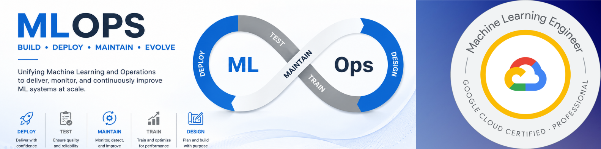

<!-- Banner Image (Optional: Replace the link with your own branded banner if you have one) -->

# Hi, I'm Dr. Dilip Rathod 👋

<!-- Tech Badges -->

  
  
  
  
  
  

🎓 **Ph.D. in IoT** | ☁️ **Certified GCP ML Engineer & AWS Solutions Architect**  
📍 Pune, India

I build **scalable, automated, and secure cloud infrastructure** and bridge the gap between Data Science and Operations by engineering **enterprise-grade MLOps pipelines**.

---

## 👨‍💻 About Me

* **Technical Lead & Cloud Architect** with **12+ years** of experience in distributed systems and cloud engineering.
* 🤖 Transitioned deeply into **MLOps & LLMOps**, specializing in operationalizing machine learning models using **GCP Vertex AI** and **Kubeflow**.
* ⚙️ Passionate about **FinOps** (reducing cloud spend by up to 30%), **GitOps** (ArgoCD), and **Zero-Trust Security** across multi-cloud environments.
* 🚀 Currently building scalable Monorepos featuring Agentic AI, RAG architectures, and real-time streaming ML pipelines for the financial sector.

---

## 🚀 Featured Projects

### 🏦 Enterprise MLOps Suite: 7 AI/ML Financial Use Cases
A comprehensive Monorepo demonstrating production-grade machine learning architectures on GCP, transitioning from traditional MLOps to modern LLMOps (Gemini).

**Architecture Flow**
`Data Ingestion (Pub/Sub + Dataflow)` $\rightarrow$ `Feature Store` $\rightarrow$ `Orchestration (Vertex Pipelines/Airflow)` $\rightarrow$ `Serving (Vertex Endpoints)` $\rightarrow$ `Monitoring (Looker Studio)`

**Key Features**
* **AML Fraud Detection:** Real-time behavioral scoring processing massive transaction volumes with `<100ms` latency using Vertex AI Endpoints.
* **Automated Credit Analysis:** LLMOps pipeline utilizing **Document AI** to extract financial P&L statements and **Gemini 1.5 Flash** for zero-shot credit risk memos.
* **Algorithmic Pricing:** Orchestrated ephemeral **Dataproc (Spot VMs)** clusters to process high-frequency market data, cutting compute costs by 80%.
* **Loan Loss Provisioning (IFRS-9):** Leveraged **BigQuery ML** for in-warehouse model training, eliminating data egress costs.

**Tech Stack**  
`GCP` • `Vertex AI` • `Kubeflow` • `Terraform` • `Gemini` • `BigQuery` • `Python`

🔗 **Repository:** [https://github.com/rathoddt/mlops-with-vertex-ai](https://github.com/rathoddt/mlops-with-vertex-ai)

 

### ⚙️ Multi-Cloud Kubernetes & FinOps Automation Framework
An infrastructure-as-code and deployment automation project designed to orchestrate clusters globally while maintaining 99.99% uptime and enforcing strict cloud governance.

**Pipeline Flow**
`IaC (Terraform)` $\rightarrow$ `CI/CD (GitHub Actions/Jenkins)` $\rightarrow$ `GitOps (ArgoCD)` $\rightarrow$ `Deployment (GKE/EKS)` $\rightarrow$ `Observability (Prometheus/Grafana)`

**Key Features**
* Built credential-less multi-cloud authentication via **Workload Identity Federation** (AWS $\leftrightarrow$ GCP).
* Achieved a **63% reduction in deployment time** by automating 100+ CI/CD pipelines.
* Engineered a complete observability stack reducing MTTR for critical incidents by 23%.

**Tech Stack**  
`Terraform` • `Kubernetes (GKE/EKS)` • `Docker` • `ArgoCD` • `Prometheus/Grafana`

---

## 🛠️ Technical Skills

**Cloud Platforms**  
`Google Cloud Platform (GCP)` • `Amazon Web Services (AWS)` • `Microsoft Azure`

**DevOps & IaC**  
`Terraform` • `Kubernetes (GKE, EKS, AKS)` • `Docker` • `Helm` • `Istio` 

**MLOps & AI**  
`Vertex AI` • `Kubeflow` • `MLflow` • `TensorFlow Extended (TFX)` • `RAG` • `BigQuery ML` • `Gemini API`

**CI/CD & Automation**  
`GitHub Actions` • `GitLab CI` • `Azure DevOps` • `ArgoCD (GitOps)` • `Jenkins`

**Observability & Scripting**  
`Prometheus` • `Grafana` • `Loki` • `Python` • `Bash` • `PowerShell`

---

## 📫 Connect With Me

  

  

---

⭐ *If you find my cloud architectures or MLOps pipelines helpful, feel free to **star** the repositories!*
